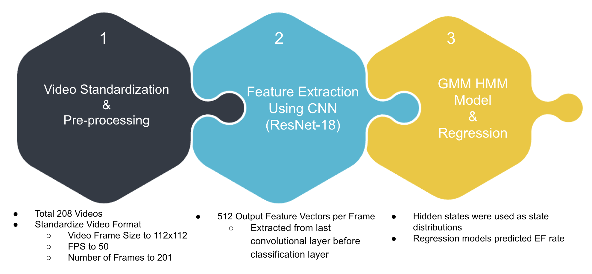

# **Bayesian Heart Rate Prediction**
---
## **Problem Statement & Motivation**

---
## **Data Set**

---
## **Model Pipeline**

### **Feature Extraction with CNN**

Inputting the raw pixel data from the videos to the Gaussian HMM can lead to computational inefficiency because of the large number of pixels that are extracted per frame, which can lead to the HMM struggling to train. Besides that, the HMM will be trained with irrelevant features from the image. To mitigate this issue, we use a pre-trained CNN called ResNet18 to extract the most important features from the pixel data in a lower dimensional space. We use ResNet18 for a few reasons:

- Pretrained on millions of diverse images, where the general features should transfer well to the medical domain
- Lightweight compared to other pretrained models, balancing between computational efficiency and performance

We will be taking the final layer before the classification layer of ResNet18 to be inputted into the Gaussian HMM for training.

### **Gaussian HMM Modeling and Regression

We use a Gaussian HMM to predict the states because our data input is continuous and we need to model complex, continuous state spaces. For the amount of hidden states, we chose 4 hidden states based on our research on different states of the heart, but multiple hidden state numbers will be considered. The output of the Gaussian HMM will be a prediction of the hidden state per frame. Then we will get the distribution of the states per video and use that as the input for our regression model.

The output of the Gaussian HMM model will then be inputted in our regression model as our independent variables (X), with the EF values as our dependent variable (y). Multiple regression models are considered, such as linear regression, ridge regression and ensemble methods (random forest, gradient boosting, XGboost) and compared with each other to find the model with the best performance.

---
## **Result / Summary**

Using a hidden state number of 4, the results of the model created are not so promising, with a high test RMSE and MAPE.

Linear Regression

Random Forest

Gradient Boosting

XGBoost

---
## **Next Steps / Future Improvements**
While our current model provides an approach to estimating ejection fraction (EF) using machine learning techniques, there are several areas for improvement and future directions.

## **1. Improving Feature Extraction**
The choice of **ResNet18** for feature extraction prioritized texture-based patterns such as **edges, curves, and gradients**. However, this may not fully capture the **temporal dynamics** of the left ventricle’s motion. To improve this:  

### **Alternative Deep Learning Models:**
- **Echonet**: A deep learning model specifically designed for echocardiography, trained on large-scale EF datasets.
- **Lidar3DCNN**: A 3D convolutional model that could capture volumetric changes more effectively.
- **TimeSformer**: A transformer-based architecture that models spatial and temporal dependencies better than CNNs.

## **2. Refining State Modeling (Beyond GMM-HMM)**
Our current pipeline applies **Gaussian Mixture Models (GMM) + Hidden Markov Models (HMM)** to model state transitions. However, several enhancements could be explored:

### **Alternative State Modeling Techniques:**
- **Deep Hidden Markov Models (DeepHMM)**: Uses neural networks to model latent state transitions more effectively.
- **Recurrent Neural Networks (RNNs) or LSTMs**: Can learn **temporal dependencies** in EF progression without requiring discrete states.
- **Transformer-based Sequence Models**: Could improve performance by better handling long-term dependencies.

### **Adaptive State Learning**
- Instead of **predefining the number of states**, use a **data-driven approach** to learn the **optimal number of EF states dynamically**.
- Why Avoid Predefining States?
    - Cardiac motion is complex and varies across patients, meaning that a fixed number of states may oversimplify or overcomplicate the EF estimation process.
    - Different patients have different ventricular motion characteristics.
    - Due to iime-dependent changes in EF, using a fixed number of states may fail to capture gradual changes in EF dynamics.

